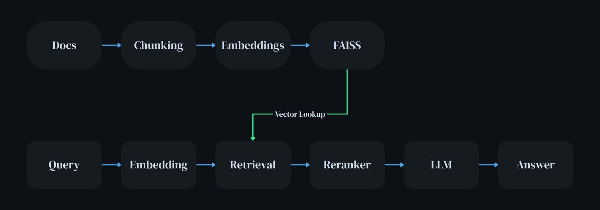

# RAG System  Modular, Local, CPU-Ready

## Overview

A clean, local Retrieval-Augmented Generation (RAG) pipeline for answering questions over your own documents. Built to mirror production patterns while staying lightweight and CPU-friendly.

---

## Highlights

* Local LLM (Ollama: Qwen 2.5)
* FAISS vector search (cosine via normalised embeddings)
* Sentence-aware chunking
* Cross-encoder reranking (better relevance)
* Persistent index
* Modular, extensible, CLI-driven

---

## Architecture



---

## Modules

* `loader.py` - load PDF/TXT → text
* `chunking.py` - sentence-based chunks
* `indexing.py` - embed + build/save FAISS
* `retrieval.py` - top‑k + rerank
* `generation.py` - prompt + streaming output
* `cli.py` - interactive loop

---

## Setup

```bash
git clone https://github.com/sobanmujtaba/RAG
cd RAG
python -m venv .venv
source .venv/bin/activate
pip install -r requirements.txt
ollama pull qwen2.5:3b
```

---

## Run

**Index (offline):**

```bash
python main.py --index
```

**Query (online):**

```bash
python main.py
```

Add files to `docs/` (PDF, TXT).

---

## Key Choices

* **CPU-first:** all models pinned to CPU for stability
* **Cosine search:** normalised vectors + `IndexFlatIP`
* **Reranking:** cross-encoder to refine hits
* **Semantic chunks:** sentence boundaries over fixed sizes

---

## Gaps

* No hybrid (BM25 + vector)
* No evaluation suite
* No UI

---

## Next

* Hybrid retrieval
* Query expansion
* Evaluation (precision/recall)

---

## Example

```
Q: What is expectimax?
A: Expectimax is a decision algorithm for stochastic settings...
```

---

## Summary

Production-style RAG, local and modular—fast to run, easy to extend.
